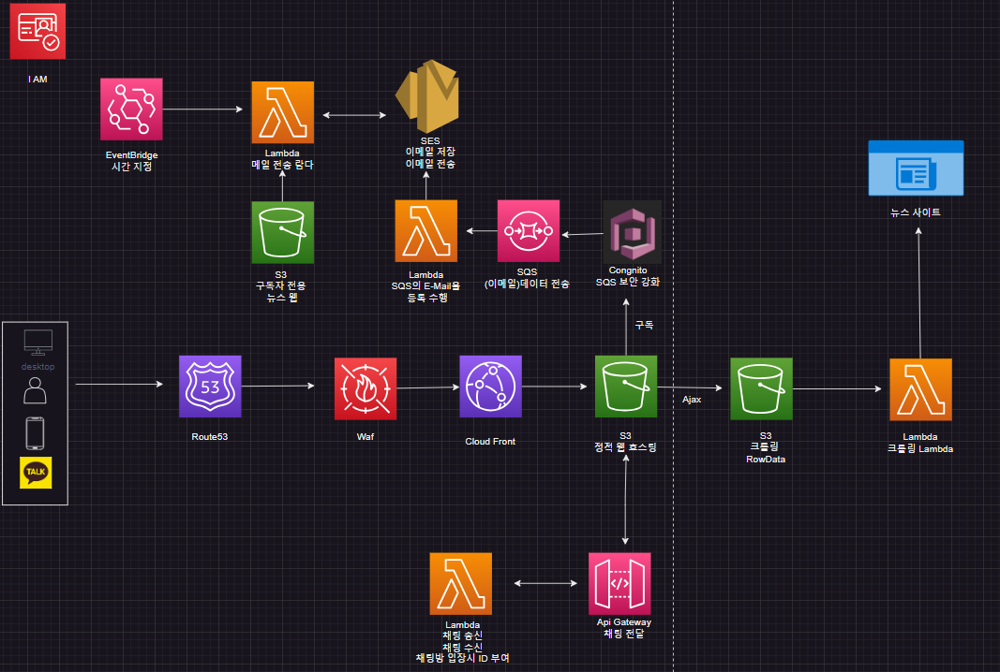

<h1>zooTopic</h1>
ZooTopic is a web service that automatically collects content from a variety of news sources and delivers it to users. This service provides up-to-date news, trends, and important event information quickly, helping users save time and effort.

<h1>System Configuration</h1>

<h1>Data Crawling:</h1>

Python: Utilizes Python along with libraries such as Pandas to automatically collect data from various news sources. These tools are powerful for parsing HTML from web pages and extracting the necessary data.

<h1>Data Processing and Storage:</h1>

AWS Lambda: Implements serverless functions to process and refine the crawled data. Lambda operates on an event-driven basis, triggered after the crawling process to automate the handling.
AWS S3: Safely stores the refined data. S3 offers high durability and is ideal for backing up and archiving the crawled news data.

<h1>Website Deployment and Management:</h1>

Amazon Route 53: Provides Domain Name System (DNS) services to manage the website’s domain and optimize traffic routing.
Amazon CloudFront: A Content Delivery Network (CDN) service that delivers content quickly to users worldwide, useful for efficiently distributing both static and dynamic web content.

<h1>Email Delivery Service:</h1>

Amazon SES (Simple Email Service): Implements a service to send summarized news emails to subscribers every morning at 6 AM. SES allows for the reliable sending of mass emails and provides statistics related to email dispatching.

<h1>Revenue Model</h1>

Subscription Service: Users can subscribe monthly or annually via the website. Subscribers receive summarized news in their email every morning at 6 AM, offering a more in-depth and ad-free experience compared to regular free content.
This system provides a technologically sophisticated yet user-friendly service, representing a modern way to consume news content. Additionally, by leveraging AWS's robust cloud infrastructure, it allows for a scalable and easily manageable system.

